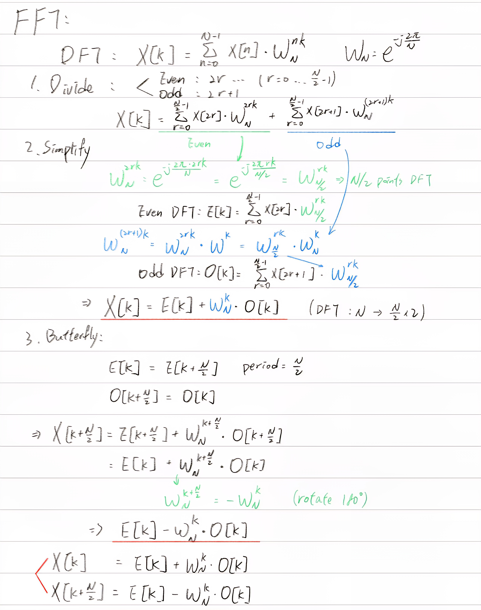

# DSPHW4 : Sampling Rate Conversion with FFT Filters
## Goal
* upsample and downsample input audio 
* implement FFT-based FIR filter
## Files
* `fftsrc.c`: main C code for sample rate conversion using FFT (recursive version)
* `fftsrc2.c`: main C code for sample rate conversion using FFT (iterative version)
* `run.sh`: bash script to compile and run the code
* `blue_giant_fragment_44.4kHz_16bits_stereo.wav`: input audio file (44.1kHz, 16bits)
* `input.wav`: testing input sinewave
## Introduction
You can use `run.sh` to compile and run the code. The output audio file will be generated as `output.wav` and `output2.wav`.

You can also check the time taken for both versions (recursive and iterative) in the terminal output after running `run.sh`.
## Results
Both versions of the code produce the same output audio files: `output.wav` from the recursive version and `output2.wav` from the iterative version. 

You can listen to both output files to verify that they sound identical. Then check `check_fs.png` to see the sampled points. One new sampled point is added arround every 5 original sampled points.
## Optimization
The iterative version of the FFT-based sample rate conversion is optimized for performance by eliminating the overhead associated with recursive function calls. Instead of calling the FFT function recursively, the iterative version uses loops (bit-reversal) to perform the FFT computation. 

## Others
### bit-reversal
In the iterative FFT implementation, bit-reversal is used to reorder the input data before performing the FFT computation. 
e.g. for N=8 (3 bits), the indices 0 to 7 are represented in binary as:  
`0, 1, 2, 3, 4, 5, 6, 7`  
`000, 001, 010, 011, 100, 101, 110, 111`  
001 -> 100 (1 becomes 4)  
After bit-reversal, the indices become:  
`0, 4, 2, 6, 1, 5, 3, 7`  
`000, 100, 010, 110, 001, 101, 011, 111`  
### FFT
By separating even and odd indexed elements, the FFT reduces the computational complexity from O(N^2) to O(N log N), making it significantly faster for large datasets.

