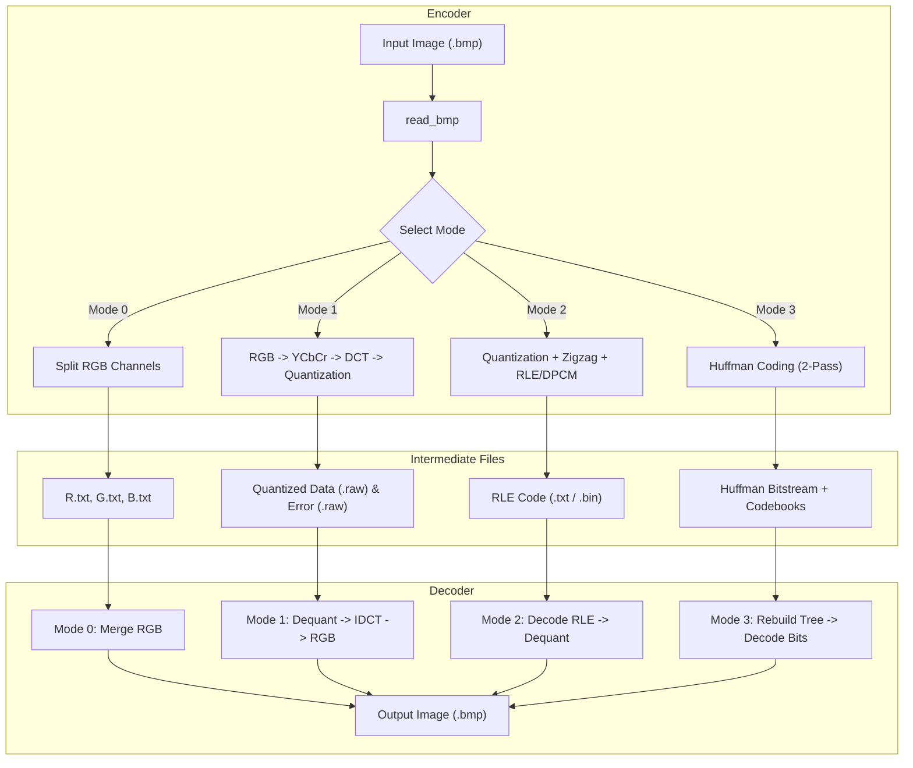
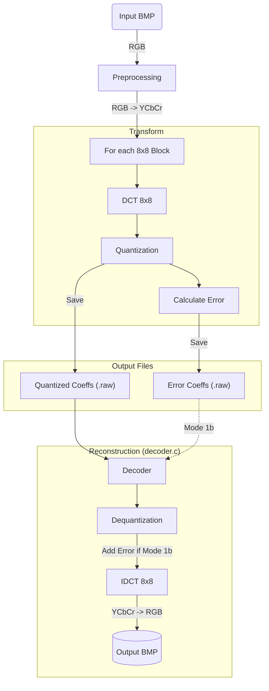
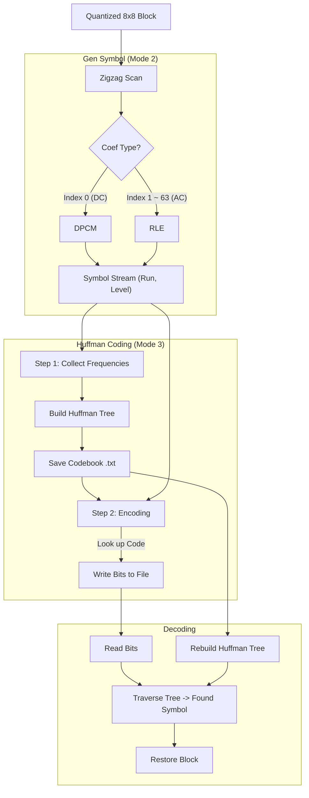

# MMSP Final Project
## Goal
The goal of this project is to implement an image compression and decompression system using various encoding and decoding techniques. The project includes four modes of operation:
1. Mode 0: check data input and output without compression
2. Mode 1: color space transformation and quantization 
3. Mode 2: compression using DPCM and RLE
4. Mode 3: compression using Huffman coding
## Requirements
* `common.h`: Shared data structures (Image, Headers) and memory settings.
* `bmp.c`: Handles BMP file parsing, header manipulation, and padding.
* `transform.c`: Implements RGB-YCbCr conversion, DCT/IDCT (8x8 blocks), and Quantization.
* `huffman.c`: Manages frequency analysis, Huffman Tree construction, and bitstream I/O.
* `encoder.c` / `decoder.c`: The main programs for encoding and decoding images in different modes.
* `Makefile`: For compiling the project.
* `run_script.sh`: A script to automate the encoding and decoding process for all modes.
## Timeline
* 12/23 - Start Project & create file structure
* 12/24 - Research & plan the project
* 12/25 - Christmas Break
* 12/26 - Implement Encoder & Decoder Mode 0, 1, 2
* 12/27 - Implement Encoder & Decoder Mode 3
* 12/28 - Testing & Debugging & Makefile & Script
## Instructions
You can run the provided script `run_script.sh` to execute all encoding and decoding modes sequentially. Make sure to give execute permission to the script using `chmod +x run_script.sh`. Then, run the script with `./run_script.sh`.

You can also compile all the code using the provided Makefile by running `make` in the terminal. This will generate the `encoder` and `decoder` executables.
### System Overview

### Mode 1 Overview

### Mode 2 & 3 Overview

## Results
### Original Files data
* R.txt : Original R channel data
* G.txt : Original G channel data
* B.txt : Original B channel data
* dim.txt : Image dimensions    
* Qt_Y.txt : Quantization table for Y channel
* Qt_Cb.txt : Quantization table for Cb channel
* Qt_Cr.txt : Quantization table for Cr channel
### Quantized Files data
* qF_Y.raw : Quantized Y channel data
* qF_Cb.raw : Quantized Cb channel data 
* qF_Cr.raw : Quantized Cr channel data
* eF_Y.raw : Entropy coded Y channel data
* eF_Cb.raw : Entropy coded Cb channel data
* eF_Cr.raw : Entropy coded Cr channel data
### Codebook files
* code_asc_*: Huffman codebook for ASCII mode prefix
* code_bin_*: Huffman codebook for Binary mode prefix
* each have Y/C channel & DC/AC components separately
### BMP Image file
* Kimberly.bmp : Original Image 
* ResKimberly_M0.bmp : Reconstructed Image from Mode 0 (No Compression)
* QResKimberly_M1a.bmp : Reconstructed Image from Mode 1(a) (Quantization lossy)
* ResKimberly_M1b.bmp : Reconstructed Image from Mode 1(b) (Lossless)
* QResKimberly_M2_asc.bmp : Reconstructed Image from Mode 2(a) (RLE ASCII)
* QResKimberly_M2_bin.bmp : Reconstructed Image from Mode 2(b) (RLE Binary)
* QResKimberly_M3_asc.bmp : Reconstructed Image from Mode 3(a) (Huffman ASCII)
* QResKimberly_M3_bin.bmp : Reconstructed Image from Mode 3(b) (Huffman Binary)
### compression files
* rle_code.asc : RLE compressed file in ASCII mode (for readability)
* rle_code.bin : RLE compressed file in Binary mode
* huffman_out.txt : Huffman compressed file in ASCII mode (for readability)
* huffman_out.bin : Huffman compressed file in Binary mode
### Reconstructed Image SQNR (dB)
Channel R: 35.04 dB  
Channel G: 35.74 dB  
Channel B: 31.47 dB  

Observe: All channels exceed 30 dB, indicating high visual fidelity. The Green channel has the highest preservation, while the Blue channel has the lowest. This result aligns with the design principle of the quantization table—applying stronger compression to less sensitive color information.
### RLE Compression Stats
Original Size: 36578358 bytes    
Compressed Size: 5982998 bytes  
Compression Ratio: 16.36%  
RLE effectively reduces the file size by removing long runs of zeros generated by Quantization and Zigzag scanning.
### Huffman Compression Stats
Original Size: 36578358 bytes  
Compressed Size: 829987 bytes  
Compression Ratio: 2.27%  
Huffman Coding achieves a massive compression by assigning shorter bit-codes to frequent symbols. This is the power of entropy coding combined with binary bit-packing.

### Impact of Quality Factor 
To understand the trade-off between image quality and compression efficiency, we analyzed the system across a spectrum of Quality Factors (Q). The Q-factor scales the quantization matrix: lower Q values discard more high-frequency coefficients (creating larger zero-runs), while higher Q values preserve more detail.

| Quality Factor (Q) | Compressed Size (Bytes) | Compression Ratio | Size (MB) | Description |
| :---: | :---: | :---: | :---: | :--- |
| **1** | 171,307 | **0.47%** | 0.16 MB | Extreme compression. Heavy blocking artifacts; recognizable but low fidelity. |
| **5** | 222,128 | **0.61%** | 0.21 MB | Higher compression. Artifacts visible, but good for previews. |
| **25** | 552,648 | **1.51%** | 0.53 MB | High compression. The image quality is better than previous levels. |
| **50** | 829,987 | **2.27%** | 0.79 MB | **Baseline Standard.** Excellent balance between size and visual quality. |
| **70** | 1,159,611 | **3.17%** | 1.10 MB | High quality. Very difficult to distinguish from original. |
| **95** | 3,301,288 | **9.03%** | 3.15 MB | x |
| **100** | 7,053,794 | **19.28%** | 6.73 MB | x |

Other statistics and detailed results can be found in extranote/ 
## Conclusion

This project was an impressive journey into the core mechanisms of JPEG compression. By implementing the entire pipeline from Color Space Transformation and DCT to Quantization and Entropy Coding, I gained deep insights into how images can be efficiently represented and transmitted. 

* **The Power of Entropy Coding**: The most astonishing result was achieving a compression ratio of 2.27% using Huffman coding. Seeing the file size drop from ~36MB to 810kB , it gave me a profound appreciation for how statistical probability can effectively eliminate data redundancy.
* **Balancing Quality and Efficiency**: Through the implementation of Quantization, I learned how different methods affect image quality. The experimental results showed that even after aggressively discarding high-frequency components, the SQNR remained above 30dB. This practically demonstrated the efficiency of the DCT energy compaction property, we can significantly reduce file size with minimal perceptual loss.
* **Software Engineering Growth**: Beyond the algorithms, this project improved my ability to structure complex software. Adopting a modular design (separating `transform`, `huffman`, and `bmp` logic) made the codebase manageable and extensible. Writing comprehensive tests and a run script also enhanced my workflow automation skills.

In summary, this project successfully transformed "image compression" from a black-box concept into a transparent, mathematical reality that I can now manipulate and optimize.

## References
* Image Compression Concepts : https://zh.wikipedia.org/zh-tw/%E5%9B%BE%E5%83%8F%E5%8E%8B%E7%BC%A9
* BMP file introduction : https://zh.wikipedia.org/zh-tw/BMP
* BMP header format: https://blog.csdn.net/lljss1980/article/details/105003766
* jpeg introduction: https://twins.ee.nctu.edu.tw/courses/soclab_04/lab_hw_pdf/proj1_jpeg_introduction.pdf
* zig-zag introduction: https://zh.wikipedia.org/zh-tw/%E6%9B%B2%E6%8A%98%E6%8E%83%E6%8F%8F

